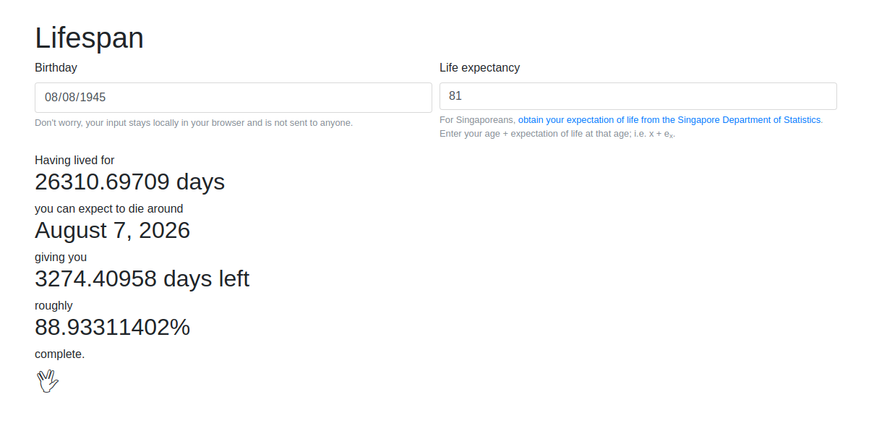
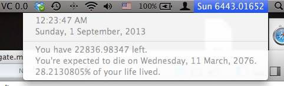

# lifespan

Website which counts up from your birthday down to your death

<https://lifespan.eliangtan.com>

## Purpose

Lifespan calculates the number of days you've lived, as well as your expected death date based on your life expectancy.

## History

While I was exploring decimal clocks in 2013, I created a Mac menu bar app which replaced the system clock with a decimal clock. On a whim, I added a death date calculator. The resulting countdown made me ponder the nature of existence.

Now it's your turn. Enjoy!

## Contrubuting

This is a simple project with only 2 source files. Contributions are very welcome.
